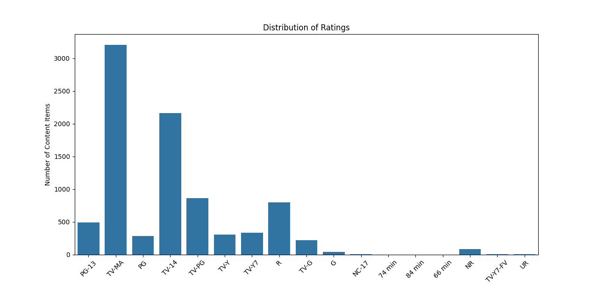
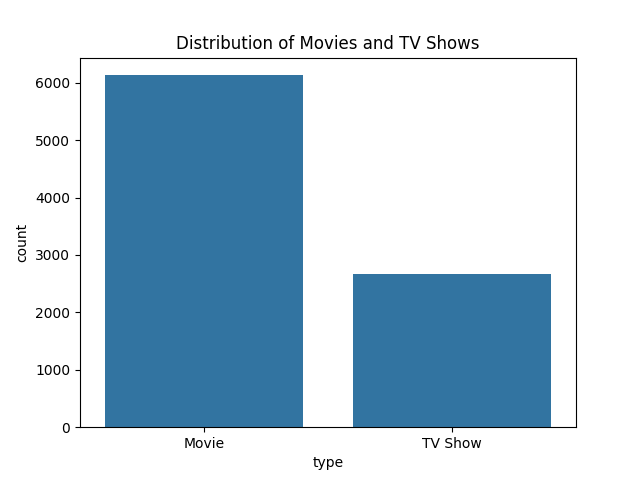
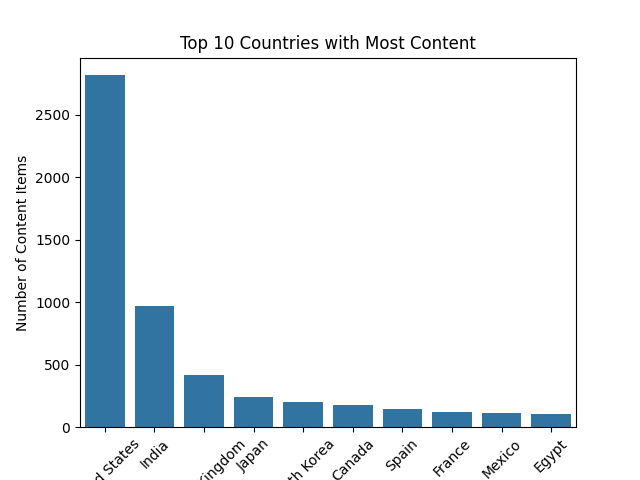
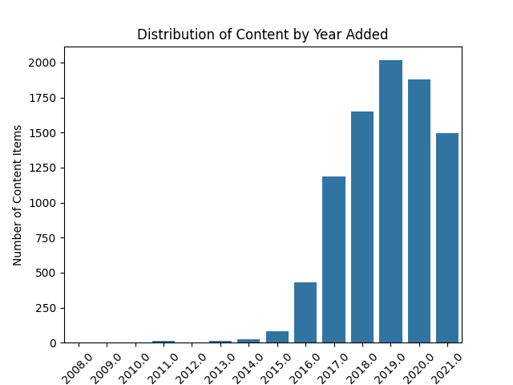

# Netflix Data Analysis using Python
This project performs exploratory data analysis(EDA) on Netflix dataset to identify patterns.

📊 Project Description:
This project analyzes Netflix dataset to uncover insights about content distribution, trends over time, and audience targeting.

🛠 Tools Used
- Python
- Pandas
- NumPy
- Matplotlib
- Seaborn

📈 Key Insights
1. Movies dominate Netflix content compared to TV shows.
2. USA contributes the highest number of titles.
3. Content additions peaked around 2019.
4. Netflix mainly targets mature audience (TV-MA rating).

Visualization

